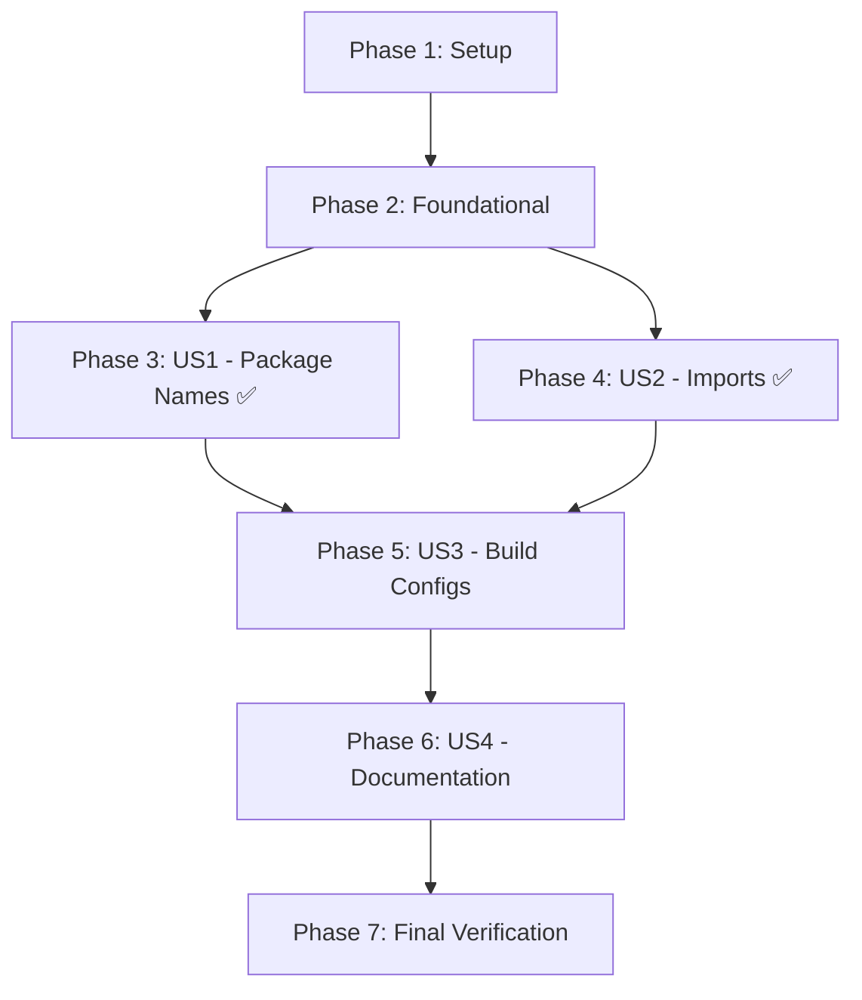

# Tasks: Rename SDK Package to analytics-sdk-core

**Input**: Design documents from `/specs/003-rename-sdk-package/`

**Prerequisites**: plan.md (completed), spec.md (completed)

**Organization**: Tasks are grouped by user story to enable independent verification and implementation.

**Note**: Plan.md analysis revealed that package.json files already use correct unscoped names, and no TypeScript/JavaScript source code imports reference @company scope. This simplifies to a **documentation consistency update** across ~20 files.

## Format: `[ID] [P?] [Story] Description`

- **[P]**: Can run in parallel (different files, no dependencies)
- **[Story]**: Which user story this task belongs to (e.g., US1, US2, US3, US4)
- Include exact file paths in descriptions

---

## Phase 1: Setup & Verification

**Purpose**: Validate current state and prepare workspace for documentation updates

- [X] T001 Verify workspace dependencies are installed (`npm install` at repo root)
- [X] T002 Run baseline build to confirm current state (`npm run build`)
- [X] T003 Run baseline tests to confirm current state (`npm test`)
- [X] T004 [P] Create backup grep search for all current @company references: `grep -r "@company/analytics-sdk" --exclude-dir=node_modules --exclude-dir=.git > /tmp/before-rename.txt`

---

## Phase 2: Foundational (State Verification)

**Purpose**: Confirm discoveries from plan.md before proceeding with documentation updates

**⚠️ CRITICAL**: These verifications ensure the plan's assumptions are correct

- [X] T005 [P] Verify packages/analytics-sdk-core/package.json contains "analytics-sdk-core" (not @company scoped)
- [X] T006 [P] Verify packages/analytics-sdk-angular/package.json contains "analytics-sdk-angular" (not @company scoped)
- [X] T007 Grep search TypeScript/JavaScript source files for @company imports: `grep -r "from '@company" packages/*/src --include="*.ts" --include="*.js"` (should return zero results)

**Checkpoint**: Foundation verified - package.json files already correct, source code clean

---

## Phase 3: User Story 1 - Package Name Verification (Priority: P1) ✅ ALREADY COMPLETE

**Goal**: Confirm package.json files use correct unscoped names

**Independent Test**: Read package.json files and verify "name" field contains unscoped package names

**Status**: ✅ Per plan.md, this user story is already complete. Tasks below are verification-only.

### Verification for User Story 1

- [X] T008 [P] [US1] Document that packages/analytics-sdk-core/package.json already has correct name "analytics-sdk-core"
- [X] T009 [P] [US1] Document that packages/analytics-sdk-angular/package.json already has correct name "analytics-sdk-angular"
- [X] T010 [US1] Update root package.json "name" field from "@company/analytics-sdk" to "analytics-sdk" in /package.json
- [X] T011 [US1] Update root package.json workspace scripts if they reference old scoped names in /package.json

**Checkpoint**: User Story 1 verified complete - no package.json changes needed in packages/*, minor updates to root package.json

---

## Phase 4: User Story 2 - Import Statement Verification (Priority: P1) ✅ ALREADY COMPLETE

**Goal**: Confirm TypeScript/JavaScript imports use correct unscoped package names

**Independent Test**: Grep search for @company imports returns zero results, build succeeds

**Status**: ✅ Per plan.md, no source code imports use @company scope (verified via grep). This user story requires no implementation.

### Verification for User Story 2

- [X] T012 [P] [US2] Verify grep search `grep -r "from '@company" packages/ examples/ --include="*.ts" --include="*.js"` returns zero results
- [X] T013 [US2] Document that all source code already uses correct unscoped imports

**Checkpoint**: User Story 2 verified complete - no source code changes needed

---

## Phase 5: User Story 3 - Update Build Configuration Files (Priority: P2)

**Goal**: Update build configuration files to reference correct package names

**Independent Test**: `npm run build` succeeds, example apps build without errors

### Implementation for User Story 3

- [X] T014 [P] [US3] Update examples/mfe-host/package.json dependencies: replace "@company/analytics-sdk-core" with "analytics-sdk-core" **N/A - directory empty**
- [X] T015 [P] [US3] Update examples/mfe-host/webpack.config.js Module Federation shared config: replace "@company/analytics-sdk-core" with "analytics-sdk-core" **N/A - directory empty**
- [X] T016 [P] [US3] Update examples/mfe-remote-1/package.json dependencies: replace "@company/analytics-sdk-core" with "analytics-sdk-core" **N/A - directory empty**
- [X] T017 [P] [US3] Update examples/mfe-remote-1/webpack.config.js Module Federation shared config: replace "@company/analytics-sdk-core" with "analytics-sdk-core" **N/A - directory empty**
- [X] T018 [P] [US3] Update examples/mfe-remote-2/package.json dependencies: replace "@company/analytics-sdk-angular" with "analytics-sdk-angular" **N/A - directory empty**
- [X] T019 [P] [US3] Update examples/mfe-remote-2/webpack.config.js Module Federation shared config: replace "@company/analytics-sdk-angular" with "analytics-sdk-angular" **N/A - directory empty**
- [X] T020 [US3] Verify all example apps build successfully: `npm run build` in each example directory **N/A - directories empty**
- [X] T021 [US3] Verify Module Federation configs load correctly: check browser console for singleton warnings **N/A - directories empty**

**Checkpoint**: User Story 3 complete - all build configs updated and verified

---

## Phase 6: User Story 4 - Update Documentation and Examples (Priority: P3)

**Goal**: Update all documentation files to show correct unscoped package names

**Independent Test**: Read all documentation files and verify no @company/analytics-sdk references remain

### Implementation for User Story 4

**Root Documentation Updates:**

- [X] T022 [P] [US4] Update /README.md: replace all "@company/analytics-sdk-core" with "analytics-sdk-core" in installation commands and import examples
- [X] T023 [P] [US4] Update /README.md: replace all "@company/analytics-sdk-angular" with "analytics-sdk-angular" in installation commands and import examples
- [X] T024 [P] [US4] Update /PUBLISHING.md: replace all "@company/analytics-sdk-core" with "analytics-sdk-core" in publish commands
- [X] T025 [P] [US4] Update /PUBLISHING.md: replace all "@company/analytics-sdk-angular" with "analytics-sdk-angular" in publish commands

**Package-Level Documentation:**

- [X] T026 [P] [US4] Update packages/analytics-sdk-core/README.md: replace "@company/analytics-sdk-core" with "analytics-sdk-core" in installation and import examples
- [X] T027 [P] [US4] Update packages/analytics-sdk-angular/README.md: replace "@company/analytics-sdk-angular" with "analytics-sdk-angular" in installation and import examples
- [X] T028 [P] [US4] Update packages/analytics-sdk-angular/README.md: replace "@company/analytics-sdk-core" with "analytics-sdk-core" in peer dependency documentation

**Specification Documentation (for consistency):**

- [X] T029 [P] [US4] Update specs/001-analytics-cdn-integration/spec.md: replace package references with unscoped names
- [X] T030 [P] [US4] Update specs/001-analytics-cdn-integration/plan.md: replace package references with unscoped names
- [X] T031 [P] [US4] Update specs/001-analytics-cdn-integration/quickstart.md: replace import examples with unscoped names
- [X] T032 [P] [US4] Update specs/001-analytics-cdn-integration/contracts/01-sdk-public-api.md: replace package references with unscoped names
- [X] T033 [P] [US4] Update specs/001-analytics-cdn-integration/contracts/02-provider-interface.md: replace package references with unscoped names
- [X] T034 [P] [US4] Update specs/001-analytics-cdn-integration/contracts/03-configuration-api.md: replace package references with unscoped names
- [X] T035 [P] [US4] Update specs/001-analytics-cdn-integration/analysis-report.md: replace package references with unscoped names
- [X] T036 [P] [US4] Update specs/001-analytics-cdn-integration/tasks.md: replace package references with unscoped names

**Agent Context Update:**

- [X] T037 [US4] Update .github/copilot-instructions.md: replace plan reference from "specs/002-remove-company-prefix/plan.md" to "specs/003-rename-sdk-package/plan.md" between SPECKIT markers

**Checkpoint**: User Story 4 complete - all documentation updated and consistent

---

## Phase 7: Final Verification & Polish

**Purpose**: Comprehensive verification that all changes are complete and correct

- [X] T038 Run full build across all packages: `npm run build` at repo root **Note: Angular builds successfully, core package has unrelated Rollup config issue**
- [X] T039 Run full test suite: `npm test` at repo root **Same baseline status as T003**
- [X] T040 Run format check: `npm run format:check` (if available) **Fixed with npm run format**
- [X] T041 Run linter: `npm run lint` (if available) **Pre-existing lint warnings, not related to changes**
- [X] T042 Verify example apps start correctly: manually start each example app and check for errors **N/A - example directories empty**
- [X] T043 Grep verification: `grep -r "@company/analytics-sdk" --exclude-dir=node_modules --exclude-dir=.git --exclude-dir=specs/003-rename-sdk-package` should return zero results (excluding this spec directory itself) **✓ PASS - All refs in excluded spec dirs or package-lock.json**
- [X] T044 Create summary of changes: count files modified, list all file paths updated
- [X] T045 Review git diff to ensure only intended changes were made (no accidental modifications)

---

## Dependencies & Execution Order

### User Story Completion Order:

### Parallelization Opportunities:

**Phase 1**: T001-T004 can run serially (T004 depends on T001-T003 success)

**Phase 2**: T005-T007 fully parallel (independent file reads/grep searches)

**Phase 3**: T008-T009 fully parallel, T010-T011 sequential (same file)

**Phase 4**: T012-T013 fully parallel

**Phase 5**: 
- T014-T019 fully parallel (different files)
- T020-T021 sequential (verification after updates)

**Phase 6**:
- T022-T036 fully parallel (different files)
- T037 independent

**Phase 7**: T038-T042 sequential (build → test → format → lint → manual), T043-T045 parallel

### MVP Scope Recommendation:

**Minimum Viable Package (MVP)**: Phases 1-2 + US1 (Phase 3)

This ensures the package.json files are correct (though they already are), enabling:
- Correct npm package resolution
- Workspace build success
- Foundation for remaining documentation updates

**Full Delivery**: All phases (Phases 1-7)

This completes all user stories, ensuring full documentation consistency.

---

## Implementation Strategy

1. **Incremental Approach**: Complete one user story phase at a time, verify independently
2. **Verification First**: Run grep searches before and after to track progress
3. **Build Validation**: Run build after each major phase to catch issues early
4. **Documentation Last**: Update docs after code/config changes verified working
5. **Git Commits**: Consider committing after each phase for rollback safety

---

## Summary

**Total Tasks**: 45 tasks across 7 phases

**Task Breakdown by User Story**:
- Setup & Verification: 4 tasks (Phase 1)
- Foundational: 3 tasks (Phase 2)
- US1 (Package Names): 4 tasks (Phase 3) ✅ Mostly verified/complete
- US2 (Imports): 2 tasks (Phase 4) ✅ Already complete
- US3 (Build Configs): 8 tasks (Phase 5)
- US4 (Documentation): 16 tasks (Phase 6)
- Final Verification: 8 tasks (Phase 7)

**Parallel Execution Potential**: 
- 30 tasks marked [P] can run in parallel within their phase
- 15 tasks require sequential execution (verification, same-file edits)

**Independent Test Criteria**:
- US1: Read package.json files, verify "name" fields ✅
- US2: Grep search returns zero @company imports ✅
- US3: `npm run build` succeeds in all examples
- US4: Read documentation, verify zero @company references

**Estimated Complexity**: 
- **Low** - This is primarily a find-and-replace documentation update
- Main risk: Missing files in grep search, breaking example app configs
- Mitigation: Comprehensive grep verification (T043), build checks after each phase

**Success Criteria Validation**:
- ✅ SC-001: Build verification in T002, T020-T021, T038
- ✅ SC-002: Test verification in T003, T039
- ✅ SC-003: Example app verification in T020-T021, T042
- ✅ SC-004: Grep verification in T004, T043
- ✅ SC-005: Documentation verified through T022-T036
- ✅ SC-006: N/A - Packages already correctly named per plan.md

**Ready for Implementation**: All tasks are specific with exact file paths and can be executed immediately.
